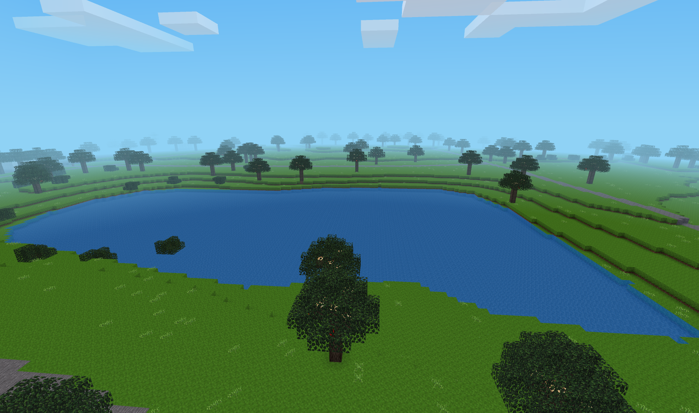
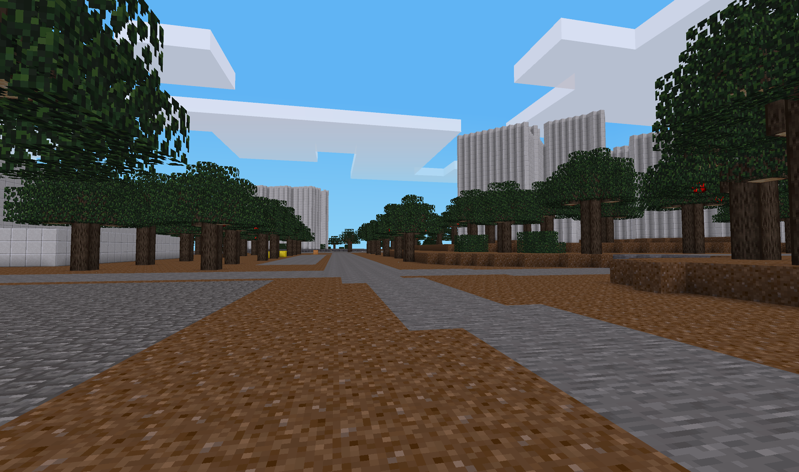
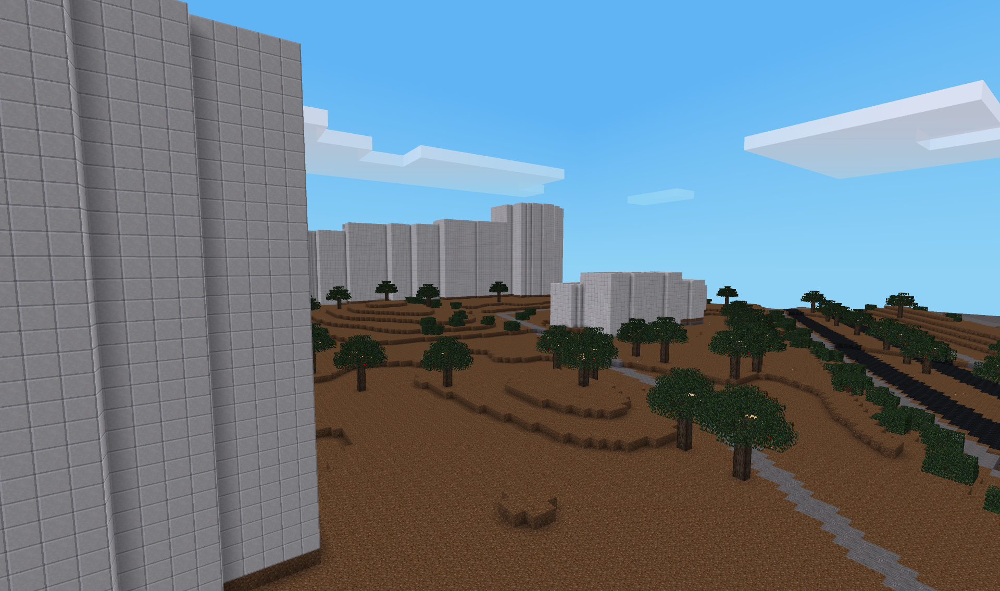
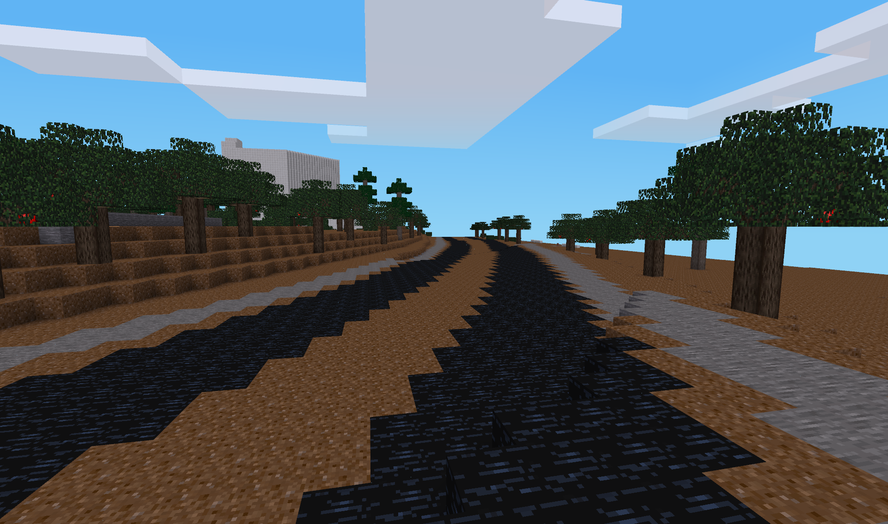

# Luanti Zukunftstage Server

**Ein schlüsselfertiger Luanti-Server, der echte Städte aus OpenStreetMap-Daten in eine Minecraft-ähnliche Welt verwandelt -- für politische Bildungsworkshops mit Jugendlichen.**

<p align="center">
  
  
</p>
<p align="center">
  
  
</p>

---

## Was sind die Zukunftstage / Zukunftsnächte?

Die **Digitalen Zukunftstage** und **Zukunftsnächte** sind Workshops, bei denen Jugendliche ab der 8. Klasse die Zukunft ihrer eigenen Stadt gestalten. In einer Spielumgebung, die auf echten Geodaten ihrer Heimatstadt basiert, bauen sie ihre Visionen: Grünflächen, Jugendtreffs, nachhaltige Verkehrskonzepte, barrierefreie Bahnhöfe oder klimaneutrale Stadtteile.

Das Besondere: Die Ergebnisse werden direkt mit lokalen Politiker\*innen diskutiert. Die Jugendlichen erleben, dass ihre Stimme zählt -- politische Bildung, die sich nicht wie Schule anfühlt.

Das Projekt wurde von der [Bayerischen Landeszentrale für politische Bildungsarbeit (blz)](https://www.blz.bayern.de/digitale-zukunftstage.html) initiiert und wird von [KidsLab.de gGmbH](https://kidslab.de) durchgeführt. Es gibt verschiedene Formate:

- **Zukunftsnächte** -- Schüler\*innen übernachten in der Schule und arbeiten intensiv an ihren Visionen
- **Zukunftstage** -- Tagesformat, z.B. als Projekttag an der Schule
- **Zukunftswerkstätten** -- Auch generationsübergreifend, z.B. [Jugendliche und Senior\*innen gemeinsam in Augsburg](https://kidslab.de/blog/demokratie-vor-ort-zukunftswerkstatt-in-minecraft-in-augsburg)

Mehr Infos zum Gesamtprojekt: [kidslab.de/projekte/demokratie](https://kidslab.de/projekte/demokratie)

## Ergebnisse

Fertige Welten und Dokumentationen vergangener Workshops gibt es auf **[zukunftsnacht.de](https://zukunftsnacht.de)** -- von der grünen Oase am Schweinfurter Busbahnhof bis zum barrierefreien Bahnhof in Erding.

## Warum Luanti?

[Luanti](https://www.luanti.org/) (ehemals Minetest) ist eine freie, quelloffene Spiele-Engine, die Minecraft sehr ähnlich ist. Dieser Server nutzt das Spielpaket **Mineclonia**, das die Minecraft-Erfahrung so originalgetreu wie möglich nachbildet -- für die Schüler\*innen ist der Unterschied zu Minecraft kaum spürbar.

Trotzdem bietet Luanti gegenüber Minecraft entscheidende Vorteile für den Einsatz an Schulen:

| | Luanti + Mineclonia | Minecraft |
|---|---|---|
| **Kosten** | Komplett kostenlos -- keine Lizenzen, keine Accounts | Kostenpflichtig (Lizenzen pro Schüler\*in) |
| **Datenschutz** | Läuft komplett lokal im Schulnetzwerk, keine Daten an externe Server, keine Microsoft-Accounts nötig | Cloud-basiert, Microsoft-Account erforderlich |
| **Installation** | Einfacher Download, keine Registrierung, läuft auf jedem Rechner | Account-Erstellung, Launcher, höhere Systemanforderungen |
| **Nach dem Workshop** | Schüler\*innen können Luanti zu Hause kostenlos weiternutzen | Lizenz nötig |
| **Modifizierbar** | Open Source -- Server und Spiel können frei angepasst werden | Eingeschränkte Modding-Möglichkeiten |
| **Multiplayer** | Eigener Server per Docker in Minuten aufgesetzt, kein Realm nötig | Realms oder eigener Java-Server nötig |

## Wie funktioniert die Weltgenerierung aus OpenStreetMap?

Das Herzstück dieses Projekts ist die **w2mt-Pipeline** (world2minetest): Sie verwandelt echte Geodaten aus [OpenStreetMap](https://www.openstreetmap.org/) in eine begehbare Luanti-Welt.

### So funktioniert es

1. **Koordinaten wählen** -- Man wählt einen Kartenausschnitt der gewünschten Stadt (zwei Eckpunkte als GPS-Koordinaten)
2. **OSM-Daten herunterladen** -- Das Skript lädt automatisch alle Geodaten aus der Overpass-API (Straßen, Gebäude, Parks, Gewässer, Bäume...)
3. **Daten verarbeiten** -- Die Geodaten werden in Luanti-Blöcke umgewandelt:
   - Straßen werden zu grauen Betonblöcken
   - Parks und Wiesen zu Grasblöcken
   - Gewässer zu Wasserquellen
   - Gebäude werden als 3D-Strukturen mit Wänden und Dächern erzeugt
   - Bäume, Zäune, Bänke und andere Details werden als Dekorationen platziert
4. **Welt laden** -- Das `world2minetest`-Mod lädt die generierte Karte beim Serverstart und die Schüler\*innen finden ihre eigene Stadt vor

### Unterstützte Kartenelemente

| Element | Darstellung in Luanti |
|---|---|
| Asphaltstraßen | Grauer Beton |
| Fußwege / Pflaster | Steinziegel |
| Radwege | Rosa Ton |
| Parks & Wiesen | Grasblöcke |
| Gewässer | Wasser |
| Gebäude | Sandstein (Wände) + Ziegel (Dach) |
| Bäume & Hecken | Eichenblätter |
| Zäune | Holzzäune |
| Bänke | Eichentreppen |
| Spielplätze | Sand |
| Parkplätze | Stein |
| Eisenbahn / Straßenbahn | Schwarzer Beton |

## Selbst nutzen -- Schritt für Schritt

### Voraussetzungen

- **Docker** und **Docker Compose**
- **Python 3** und `pip` (nur für die Weltgenerierung)
- **Git**

### 1. Repository klonen

```bash
git clone https://github.com/kidslabde/Luanti-Zukunftstage-Server.git
cd Luanti-Zukunftstage-Server
```

### 2. Welt generieren

Das Skript erstellt automatisch eine Python-Umgebung und installiert alle Abhängigkeiten:

```bash
./generate_world.sh
```

Es fragt nach:
- Einem **Projektnamen** (z.B. `02-Muenchen`)
- Zwei **GPS-Koordinaten**, die den gewünschten Kartenausschnitt definieren

> **Tipp:** Auf [openstreetmap.org](https://www.openstreetmap.org/) den gewünschten Bereich suchen, auf "Export" klicken und die Koordinaten des Rechtecks ablesen.

Alternativ direkt mit Parametern:

```bash
cd w2mt
python3 w2mt.py -p "02-Muenchen" -a "48.12,11.54,48.14,11.58" -g "mineclonia" -b "leveldb"
```

### 3. Server starten

```bash
./startWorld.sh
```

Das Skript listet alle verfügbaren Welten auf und startet den ausgewählten Server als Docker-Container. Optional mit Port-Angabe:

```bash
./startWorld.sh 02-Muenchen 30102
```

Der Server ist dann unter `localhost:30102` (UDP) erreichbar.

### 4. Verbinden

- [Luanti herunterladen](https://www.luanti.org/downloads/) und installieren
- Server-Adresse: IP des Servers, Port wie konfiguriert (Standard: `30000`)
- Standardpasswort: `zukunft`

### 5. Server stoppen

```bash
./stopWorld.sh 02-Muenchen    # Einzelne Welt stoppen
./stopWorld.sh all             # Alle Welten stoppen
```

## Workshop-Konfiguration

Der Server ist speziell für den Einsatz mit Jugendlichen konfiguriert:

- **Kein Schaden, kein PvP** -- niemand kann verletzt werden
- **Keine Monster, kein Hunger** -- keine Ablenkung vom Bauen
- **Keine Explosionen, kein Feuer, keine Lava** -- Anti-Grief-Schutz
- **Kreativmodus** -- alle Blöcke unbegrenzt verfügbar
- **Fliegen & Schnellbewegung** -- einfache Navigation durch die Stadt
- **Bis zu 50 gleichzeitige Spieler** -- getestet mit 40+ Teilnehmer\*innen

Zusätzlich enthält der Server einen **Grief-Analyzer** -- ein Web-Tool für Mentor\*innen, das verdächtiges Verhalten erkennt und meldet.

## Projektstruktur

```
├── w2mt/               # Python-Pipeline: OSM-Daten → Luanti-Welt
├── mods/               # Server-Mods (WorldEdit, Travelnet, Dekorationen, ...)
├── games/mineclonia/   # Mineclonia-Spielpaket
├── worlds/             # Generierte Welten (XX-Stadtname/)
├── analyzer/           # Grief-Analyzer Web-Tool
├── main-config/        # Server-Konfiguration
├── docs/               # Workshop-Dokumentation & Anleitungen
├── startWorld.sh       # Server starten
├── stopWorld.sh        # Server stoppen
├── generate_world.sh   # Neue Welt generieren
└── docker-compose.yaml # Docker-Konfiguration
```

## Kontakt & Unterstützung

Dieses Projekt wird aktiv von **[KidsLab.de gGmbH](https://kidslab.de)** betrieben und weiterentwickelt. Wir haben **über 60 Veranstaltungen** durchgeführt und unterstützen gerne -- organisatorisch, technisch oder inhaltlich.

**Gregor Walter**
Geschäftsführer, KidsLab gGmbH
[gregor@kidslab.de](mailto:gregor@kidslab.de)

---

## Lizenz & Credits

- **w2mt** (world2minetest) basiert auf der Arbeit von [Florian Rädiker](https://github.com/florianhofhammer/world2minetest) (AGPLv3)
- **Mineclonia** -- [mineclonia.net](https://mineclonia.net/) (AGPLv3)
- **Luanti** -- [luanti.org](https://www.luanti.org/) (LGPL 2.1)
- Projektpartner: [Bayerische Landeszentrale für politische Bildungsarbeit](https://www.blz.bayern.de/)
